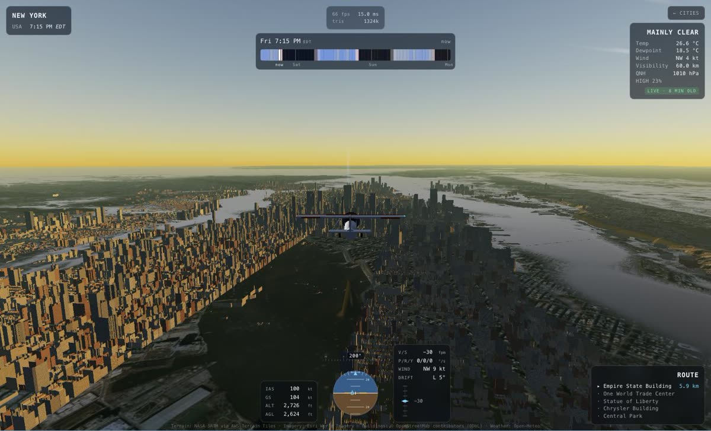
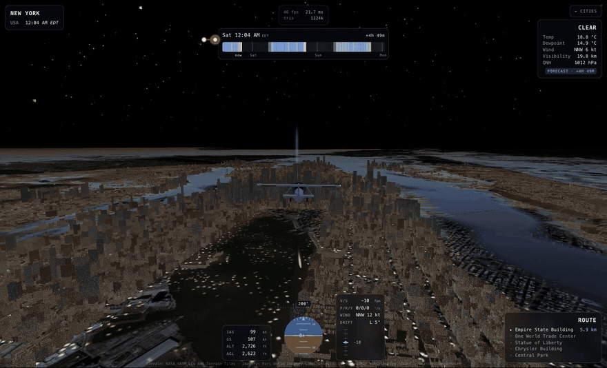

# FLYBY

Fly real places under the weather that is actually happening there.

### [Play it →](https://cs01.github.io/flyby-web/)

Drag the scrubber and the sun and the forecast move together: dusk, night,
sunrise, and an overcast morning a day and a half out.

